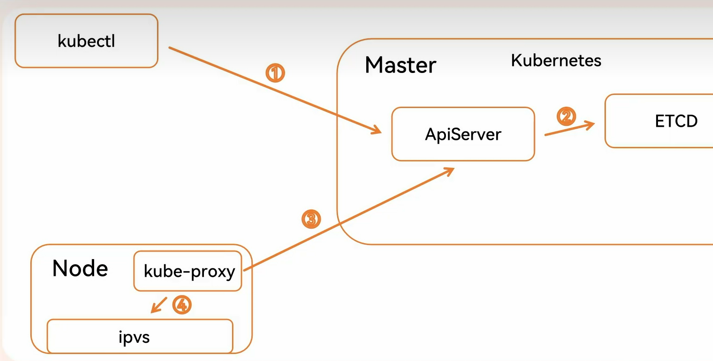
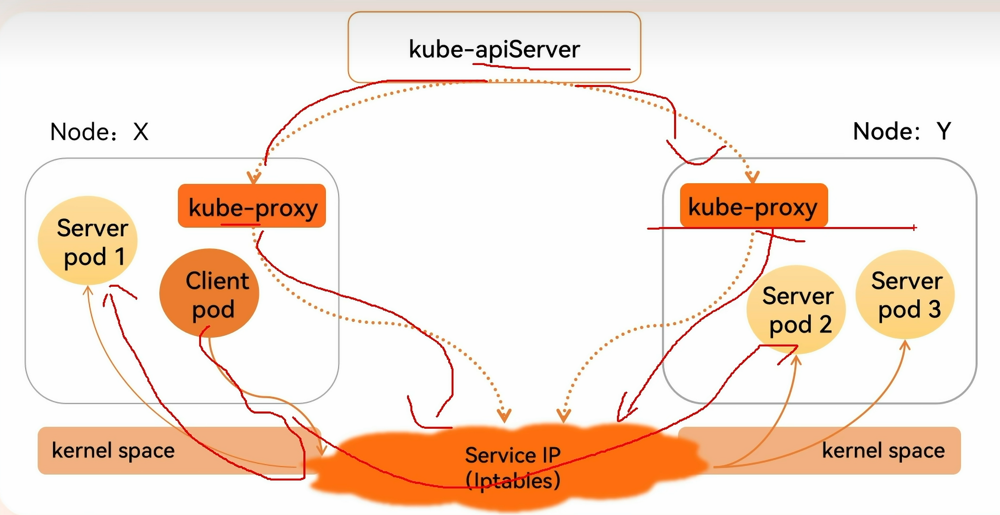
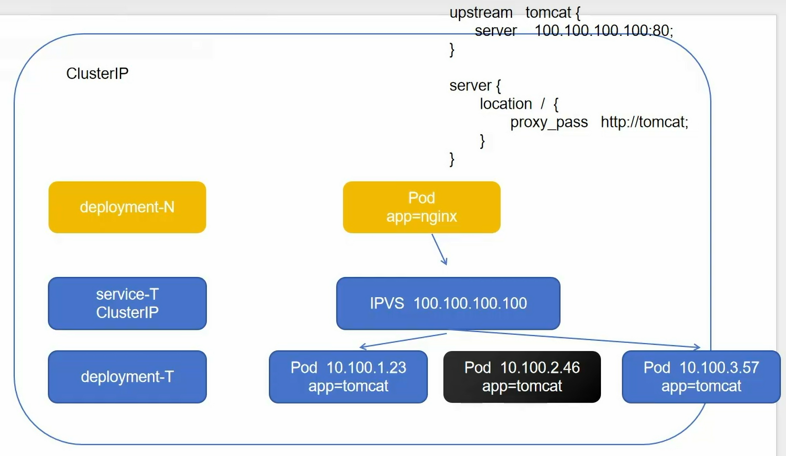
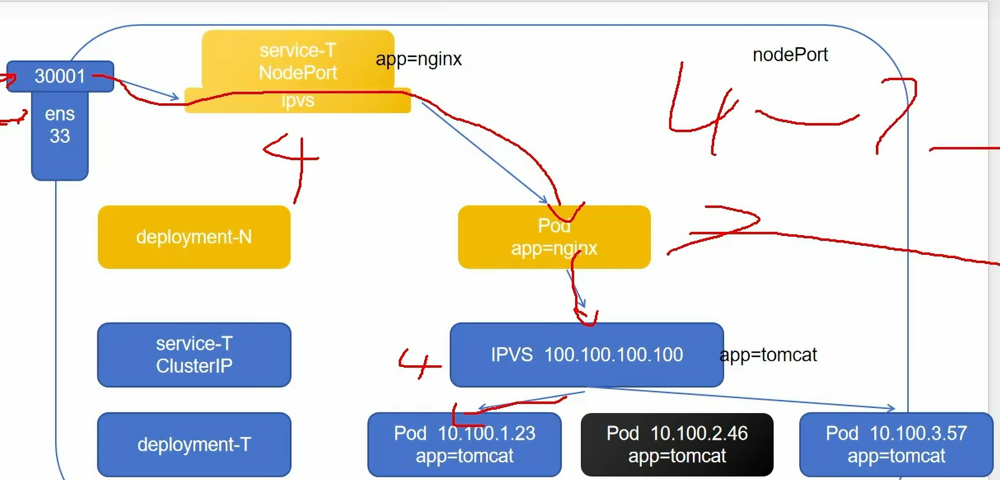
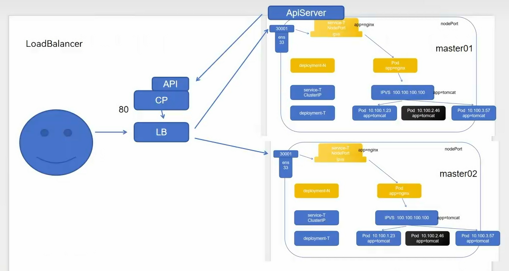
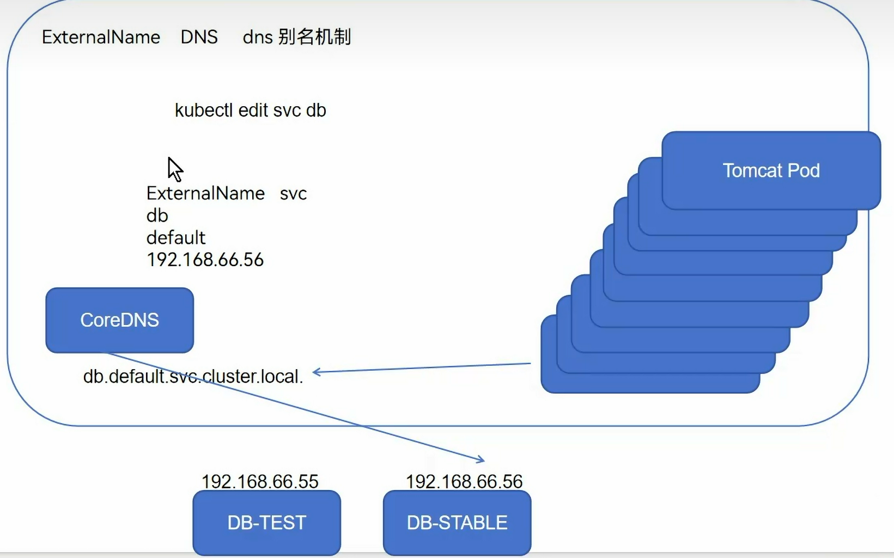

暴露服务的重要方式

负载均衡，一组pod可以被service访问到，需要通过Label Selector（就绪探测后）
# 核心原理
集群中，每个节点都运行了一个kube-proxy进程，负责通过iptables或ipvs模式为service实现一种VIP（虚拟IP）的形式

kube-proxy是一个网络代理组件

默认代理为iptables（防火墙)，新版本增加了ipvs代理，这是kube-proxy的两种工作模式，决定了如何实现流量转发（通过不同规则）

==监听apiserver：获取当前负载均衡的信息==
	service定义：虚拟IP，端口，协议
	endpoints：后端pod的IP，端口
随后将这些信息转化为ipvs规则

==组件协同==

## iptables

不同于userspace，==kube-proxy的工作只监听apiserver，将service变化修改本地的iptables规则。==不再代理当前节点pod的用户请求

优点：相对于userspace，kube-proxy的功能解耦，压力减小

## ipvs
同上模式，规则变为ipvs规则，四层性能更强，但很多云厂商阉割这个模块
```bash
kubectl edit configmap kube-proxy -n kube-system
# 修改kube-proxy模式
# -n namespace名字空间，需要指明
```

```bash
kubectl delete pod -n kube-system -l k8s-app=kube-proxy
# 修改模式后需要将原来资源删除，自动重建
# 之所以带名字空间，匹配k8s-app，是因为并不是删除集群所有pod，kube-proxy只是组件之一，只是为了更新设置，所以重启它的名字空间下的对应标签之下的pod资源即可
```

```bash
ipvsadm -Ln
# 查看负载均衡，可以看到svc和pod的IP地址
```

# 工作模式
## ClusterIP
默认类型，自动分配一个仅cluster内部可以访问的VIP，可以屏蔽pod的动态变化

如果没有svc，想要实现负载均衡需要在nginx内部定死三个tomcat的IP，无法解决pod重建IP更换，扩缩容的问题

```bash
kubectl create svc clusterip <svc-name> --tcp=<cli-node>:<ser-node>
# 冒号前端口是svc对外暴露给客户端的端口（nginx）
# 冒号后端口是想要隐藏的真实服务器的端口（tomcat）
# 通过create创建是直接被apiserver转为json格式去创建，不指明会默认匹配标签等于svc名字
```
### 访问svc方式
除了kubectl get svc查看IP进行访问，还可以借助dns插件
每个svc被创建后，会有一个dns的域名，在插件中被解析，结果就是这个svc的IP

pod中会有两个core-DNS插件，其IP并不需要知道，因为已经被负载均衡
只需要找到负载均衡集群的IP即可，可通过ipvsadm -Ln查找（具有tcp和udp的那个），也可以通过他所在的名字空间去kubectl get svc -n kube-system获得该集群IP
```bash
dig -t A <service-name>.<namespace>.svc.cluster.local. @<dns插件负载均衡集群IP>
# cluster.local. 默认域名
# 需要@是因为要用到dns来解析命令中的域名，@后跟的是dns
```
即可得到svc的IP

---

前者通过IP，方便快捷
后者通过域名<service-name/>.<namespace/>.svc.cluster.local，可在svc创建前就确认IP，只需要知道svc名字，名字空间，集群域名

## NodePort
为svc在每台机器上绑定物理网卡的一个端口，==供外部通过<NodeIP/>:<NodePort/>访问==


## LoadBalancer
多层套娃解决单点故障问题
比如nodeport模式中，外部用户可以通过负载均衡去访问合适的节点，而不是自己选


## ExternalName
将集群外部服务引入到集群内部，没有任何类型代理被创建，基于DNS别名机制，高版本1.7+支持


# 持久化连接
不同于负载均衡，始终会被定向到同一个节点
- 底层网络规则方式
```bash
ipvsadm -A -t <svc-VIP>:<Port> -s rr -p 120
```

- 利用k8s的api声明
在当前的svc中编辑```YAML

```spec.sessionAffinity=Clienti
场景：HTTP连接，重复的连接很消耗资源，比如密钥等数据的传输