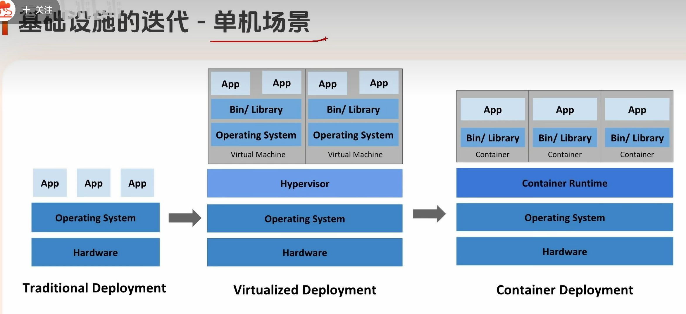
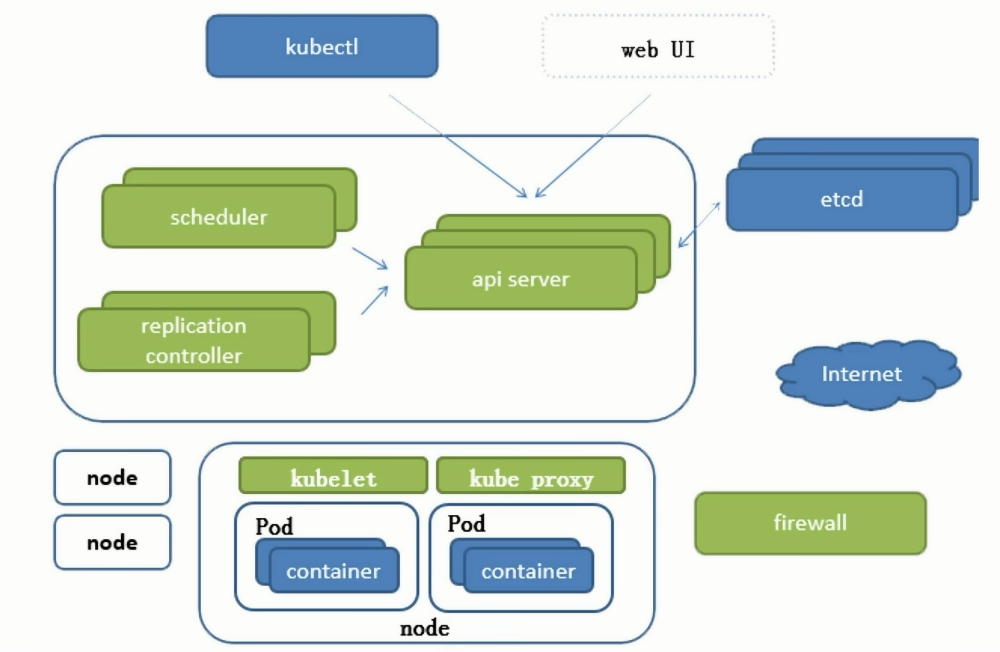

# 基础设施的部署模式的演进趋势

- IaaS：基础设施即服务
底层就是图中第二阶段：虚拟化技术

云厂商卖给你一台毛坯房只通了水电网络。装修做饭家具需要自己做，例如装系统，安装服务，部署代码等

- PaaS：平台即服务
第三阶段：容器化就是它的最佳实现方式

云厂商给你提供一个设备齐全的房子。直接带着之前打包好的docker镜像，放在这个容器中即可

# k8s微观架构

分为master和node
# Pod

最小部署模块

