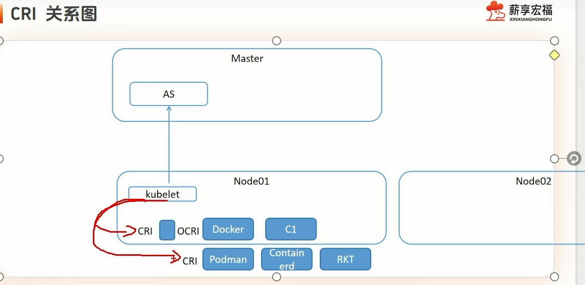
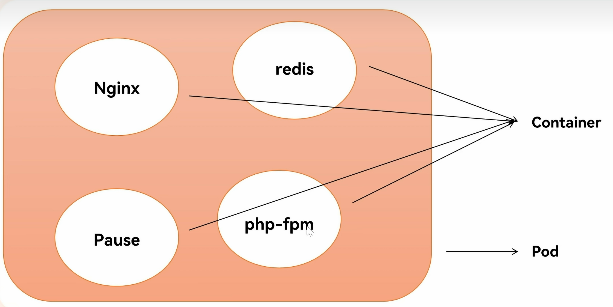

# 基础设施的部署模式的演进趋势

- IaaS：基础设施即服务
底层就是图中第二阶段：虚拟化技术

云厂商卖给你一台毛坯房只通了水电网络。装修做饭家具需要自己做，例如装系统，安装服务，部署代码等

- PaaS：平台即服务
第三阶段：容器化就是它的最佳实现方式

云厂商给你提供一个设备齐全的房子。直接带着之前打包好的docker镜像，放在这个容器中即可

# ==k8s微观架构==

分为master和node两种节点
kubelet监听api server和pod的变化，启停容器
想要创建容器需要docker或者podman

cri是容器运行时接口
容器运行时有docker,podman,containerd,cri-o
- containerd与docker两个运行时的区别在于：前者摒弃掉了cri-docker--->dockerd这一流程，负担更少
- cri-o是专为k8s而生，完全独立与docker
- podman旨在替代docker，与docker高度重合

所以如果使用docker，要有一个cri转换ocri的工具：cri-docker

==kubelet--->cri-docker--->dockerd--->containerd--->runc--->my-app-container==

# Pod

pod是最小部署模块

pause是pod内部第一个要启动的容器：比其他容器最先启动要稳定
	初始化网络栈
	挂载存储卷
	回收僵尸进程：只有pause可以，这就是为什么不能让其他容器最先启动并共享

其中每个容器都会与pause共享网络和PID，如果不共享，容器的IP会随着消失而消失，造成麻烦

# 虚拟机安装
==root密码是rocky123==
设置网卡，防火墙，关闭seliunx，修改内核等等

# 网络
k8s模型需要所有pod在一个可以互相连通的网络空间
GCE（谷歌）里部署k8s直接完成这个需求
但如果是私有云或自建机房，需要自己实现

# 安装方式

kubeadm安装
	组件通过容器化方式运行
	简单，自愈

二进制安装
	组件变成系统进程的方式运行
	灵活安装集群，规模可以更大

# 网卡配置
网卡两块：仅主机ens160，nat模式ens192
因为calico，先关闭第二块网卡：autoconnect=false关闭开机自启

## 解决ping不通外网问题
先是重新设置软路由lan口地址为192.168.100.1
然后在win11系统的网络设置v1网卡为手动获取IP地址，得到了192.168.100.2
从web端开启软路由DHCP服务，发现网段不对，编辑为100.1~100.254
本应在三台主机也开启DHCP服务从中自动获取IP，但手动设置静态了100.11/12/3，无伤大雅
最后发现因为校园网原因，dns不对，于是改用win11的网卡上的dns，将其设置在了ikuai和三台主机上

经此发现，其实不需要开头改lan口地址，只需要编辑软路由的DHCP服务中的网段与lan口地址（也就是网关）相同即可。最关键是设置dns。

# 系统软件源
去/etc/yum.repos.d/中
查看repo文件内容，grep过滤有没有国内镜像网站（aliyun.com)

# 防火墙修改
关闭且禁用firewalld，改用iptables

# 禁用seliunx，设置时区，关闭swap分区
# 主机名修改
/etc/hosts
# 安装ipvs，开启路由转发，加载网桥
# 安装docker
先从中科大镜像站下载官方yum源配置文件，结果是在/etc/yum.repos.d目录下生成docker-ce.repo文件

这个配置文件中的网址很慢，需要替换成国内镜像

然后就可以下载docker-ce
# 配置daemon

