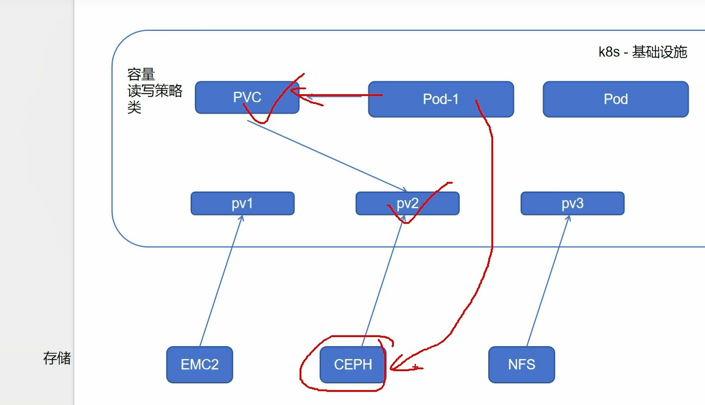

# 元数据类型
## configMap
明文保存配置数据
以==注入方式==将信息传递给pod，而非共享

```bash
kubectl create cm <cm-name> --from-file=hongfu.file
# -f后只能用.yaml,.json后缀文件
# --from-file可以跟任意文件（文本，二进制），内容即数据

kubectl create cm <cm-name> --from-file=hongfu.file --dry-run -o yaml > hongfu.yaml
kubectl create -f hongfu.yaml
# 如果必须想要通过资源清单创建cm的方法

kubectl create cm <cm-name> --from-literal=name=zhangsan --from-literal=pw=123
# 适用于简短的键值对
```

```YAML
apiVersion: apps/v1
kind: Deployment
metadata:
  name: my-app
spec:
  replicas: 1
  selector:
    matchLabels:
      app: my-app
  template:
    metadata:
      labels:
        app: my-app
    spec:
      containers:
      - name: app-container
        image: nginx
        volumeMounts:
        - name: config-volume       # ← 引用下面定义的 volume 名
          mountPath: /etc/config    # ← 容器内挂载路径
      volumes:
      - name: config-volume         # ← volume 名（自定义）
        configMap:
          name: my-cm              # ← 关联已存在的 ConfigMap 名称
```

### 热更新
挂载后，cm的每个key都会在挂载目录下成为一个文件，文件内容只有对应value
文件形式为热链接

注意：
- `volumeMounts.name` 必须和 `volumes.name` 一致
- 挂载后，**原目录内容会被覆盖**（类似 bind mount）
- 更新 ConfigMap 后，**挂载的文件会自动更新（约 1 分钟延迟）**，但应用需自行 reload 配置

可以将未来可能会修改的配置文件都抽象在cm资源中，修改后会再挂载回pod内部
避免了重新封装镜像，重新编写控制器

### 不可更改
热更新会不停监听apiserver，当确定不改变配置文件，可设置为不改变
immutable:true
设置后，再edit会修改不成功
显著降低apiserver的负载，提升集群性能
## Secret
编码保存敏感数据
默认0paque类型
secret的value值在被使用时会自动解码，所以写入时一定要编码

### 热更新
同cm
当已经存储与卷中被使用的secret被更新时，被映射的键也终将被更新。
使用secret作为子路径卷挂载的容器不支持热更新

### 不可更改
同cm

## Downward API
k8s的一个功能，并不属于存储，是一种元数据注入机制
允许容器在运行时从k8s API服务器获取有关它们（容器）自身的信息
可作为容器内部的==环境变量或文件==注入到容器，以便获取其运行环境的各种信息：pod名称，名字空间，标签，==资源限制==等
不同于``kubectl get pod``命令从外部获取，downwardapi机制可以让pod自己知道自己的元数据

```bash
kubectl exec -it <pod-name> -- /bin/bash
# -i -t 在容器中开启一个模拟终端可供输出

env
# 查看环境变量
```

复杂用挂载卷，简单用env
env一次注入，后续不会更新
# 真实数据类型
## Volume
存储临时或者持久性数据

为什么会存在volume：
- 容器重建后，会恢复镜像最初状态
- pod同时运行多个容器通常需要共享文件
- 
### emptyDir
用作pod内部多容器文件共享问题

生命周期与pod一致，最初为空（资源清单体现为``emptyDir: {}``)，存储位置为节点临时目录（kubelet管理）
尽管此卷挂载到不同容器的路径可以不一样，但容器可以读写卷中相同文件

### hostPath
节点本地存储，不能跨pod共享（除非另一个pod也被调度到同一节点且挂载同一路径）

pod重建后还可以保留数据（因为数据在节点本地）

在该pod被调度的节点中创建一个目录，该pod中的容器挂载上去

## PV/PVC
申请制的持久化存储


pod绑定pvc，pvc关联匹配合适pv，pv背后是存储
相当于pod使用存储，各部门解耦合作

关联条件
- 容量：pv值不小于pvc要求

- 读写策略：
	单节点读写RWO
		适合本地锁EXT4，XFS
	
	多节点只读ROX
	
	多节点读写RWX
		适合网络锁GFS

- 存储类：类必须一致，不存在包容降级关系


