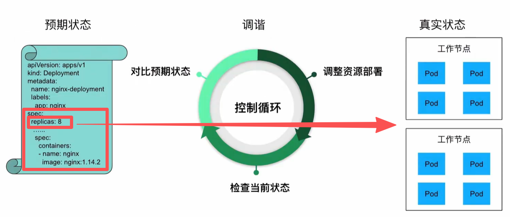
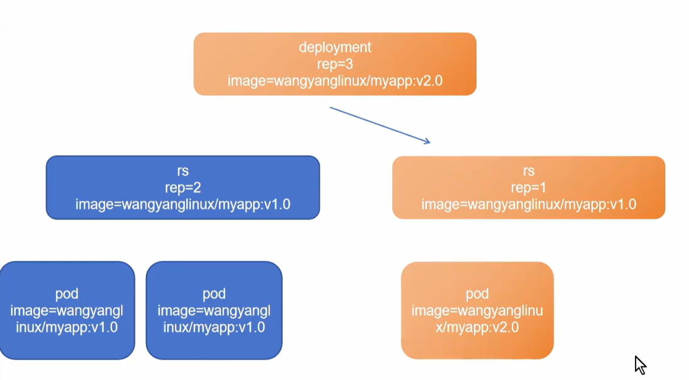

控制器用来==不断地==确保集群当前状态与期望状态（清单的spec部分）保持一致

==任务模型分为：==
- 守护进程任务：deployment，ds
场景：数据库，web服务器，监控代理

- 批处理任务：job
场景：数据迁移，备份

二者区别在于==重启策略restartPolicy==不同：
- Always：容器退出会被视为异常，必须重启
- OnFailure：成功退出（返回码为0），结束；失败才会重启
- Never：顾名思义，无论成功退出失败退出
# Pod控制器


## RC
rc会创建期望数量的pod，并自动将其labels与自己的selector相同，前提是selector是模板中的labels的子集

==注意：==
当一个pod损坏（可能所处节点损坏）时，rc会重建一个pod来尽量满足期望

当一个pod的容器损坏（进程被杀死）时，只要pod的重载策略是always，pod就会重建一个新容器并重启->RESTARTS字段加一（kubectl get pod -o wide可观察到）

## RS
改良版rc，selector下多了matchExpressions字段，可以匹配运算，更好管理pod
```YAML
spec: 
  replicas: 3 
  selector:   
    app: rc-demo
    # rc 只能做等价匹配
    
spec: 
  replicas: 3 
  selector:   
    matchLabels:
      app: rs-demo
    matchExpressions：
      operator: In
      # rs 还可匹配运算

```

## Deployment
为pod和rs的创建提供声明式定义方法
deployment会创建一个rs，rs再去创建pod
### 声明式命令
- 声明式
```bash
kubectl apply -f deployment.yaml --record
# 只替换更改部分
# --record可以记录命令，下次不加会直接复制上次更新状态
```
- 命令式
```bash
kubectl replace -f deployment.yaml
# 全部覆盖
kubectl create -f deplyment.yaml
# 也是一种命令式，但如果资源已存在该命令会报错
```

### 回滚更新
deployment更新镜像版本后，不会修改原来rs中的镜像版本号，而是重新创建新的rs，用来创建新版本的pod
此过程会慢慢迭代，旧版本和新版本会此消彼长，不会一次杀死旧版本pod



回滚策略支持最多或 最少为原来期望数量的25%

金丝雀部署：
用极少的数量测试当前版本的稳定性

### 清理策略
- 旧rs在etcd中，作为记录，想要回滚依赖etcd中的旧rs，可以利用rollout命令回滚

- 设置spec.revisionHistoryLimit=0，etcd中不再存放旧rs，每次更新，用不同yaml文件，文件名记录更新时间，人物，内容。每次的更新用不同的yaml文件保存在磁盘中作为更新记录，想要回滚使用apply命令
后者避免了多次回滚并行的现象
==回滚是deployment的行为，并非rollout的专利==

## DS
确保全部（或一些）node上运行一个pod副本，**动态匹配**
当daemonset被删除，这些pod也会被回收

---

## Job
==支持批处理任务==

spec.completions 需要成功退出的pod数，默认1
spec.parallelism 最大并行pod数
spec.activeDeadlineSeconds 失败pod的重试最大时间，超过则不会继续重试

## Cron Job
1.8版本引入
管理基于时间的job
周期性的创建job--->数据库的周期性备份

spec.schedule 调度，指定任务运行周期
spec.jobTemplate job模板


