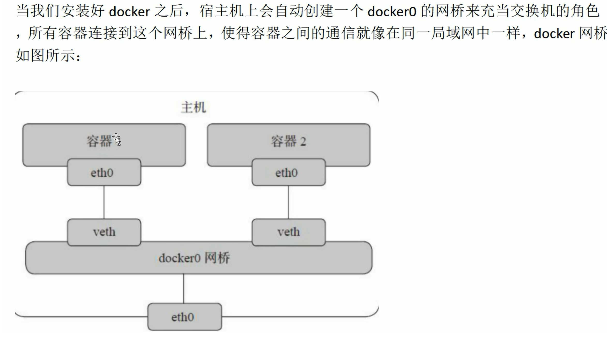
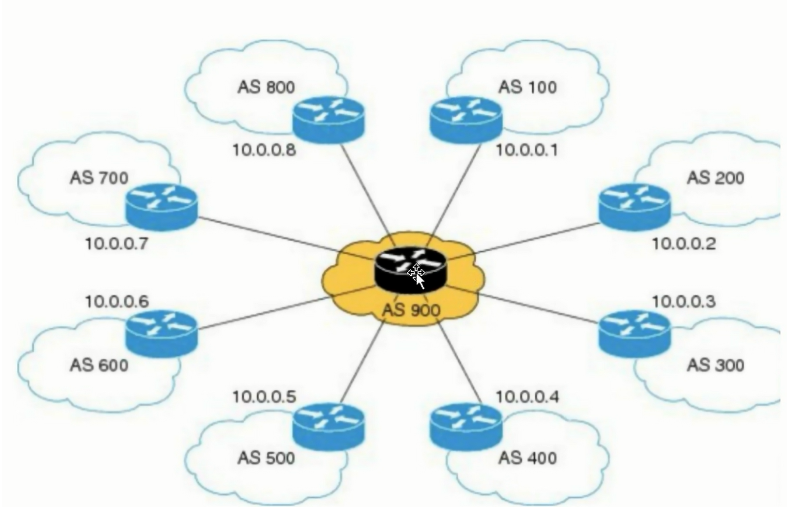

kibana的部署，相当于web服务器
fluentd采集日志，可在kibana网页查看
vim xx.yaml
kubectl apply -f xx.yaml

二者属于helm的组件

# k8s网络工作原理
## docker网络模型

装了就会有虚拟网卡docker0，对比VMware会有vmnet0,vmnet8两个网卡，充当交换机
？：ens33这个是否是同种道理
？：虚拟网卡docker0，vmnet等之后会连上宿主机的网卡，实现虚拟机上网？

iptables作用：防火墙，导流：截获容器访问外网的流量，转发到目标外网
## k8s网络模型
k8s集群中，多个节点情况下，不同节点中的pod通信需要网络插件calico或flannel
遵循CNI（存储），CRI（运行）标准
### calico
不仅支持跨网段，还支持网络隔离

安装好插件还需要一个管理工具calicoctl
GitHub找对应版本

三种工作模式：会原理
- ipip隧道--跨网段传输
- bgp动态路由--同一网段，更低延迟
==性能提升==：当节点小于100个时，使用==路由反射器==解决网状结构带来的性能拖累

- vxlan大二层，扁平化管理方式--数据中心
### flannel
与calico区别在于：
不支持节点在不同的网段，即支持二层连通（交换机所在的数据链路层）
但通过vxlan技术支持宿主机跨网段

# Helm
如今的工程在微服务化，容器化
==helm是k8s的包管理工具，相当于linux的yum/apt-get命令==
go语言编写
GitHub下载