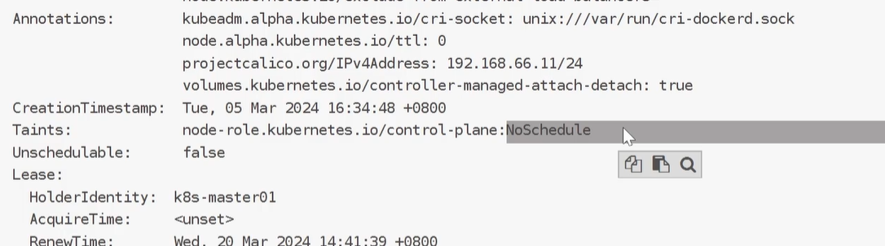

Scheduler，监听apiserver，把定义的pod分配到集群的节点上
默认default-scheduler，可自定义
预选，优选
# 亲和性
``pod.spec.nodeAffinity``
- 软性
 不满足就算了

- 硬性
达不成就是pending状态

# 容忍与污点
相互配合，用于避免pod被分配到不合适的节点上
每个节点可以应用一个或多个污点，不能容忍这些污点的pod不会被该节点接收

``key=value:effect`` value可空
effect：
	NoSchedule
	PreferNoSchedule
	NoExecute

master节点自带污点：不参与调度

# 固定节点调度

