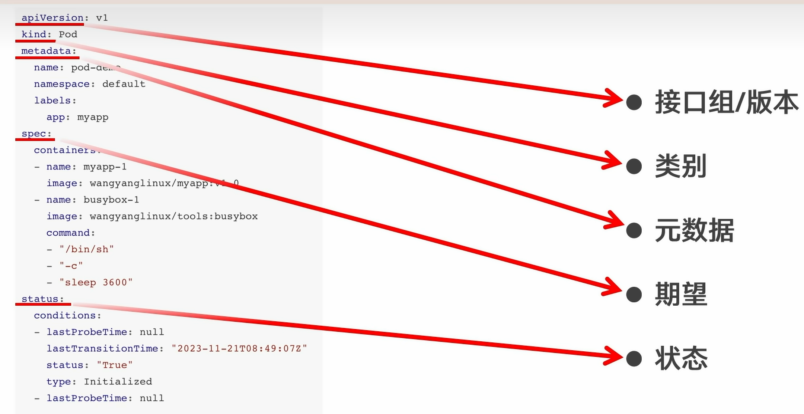
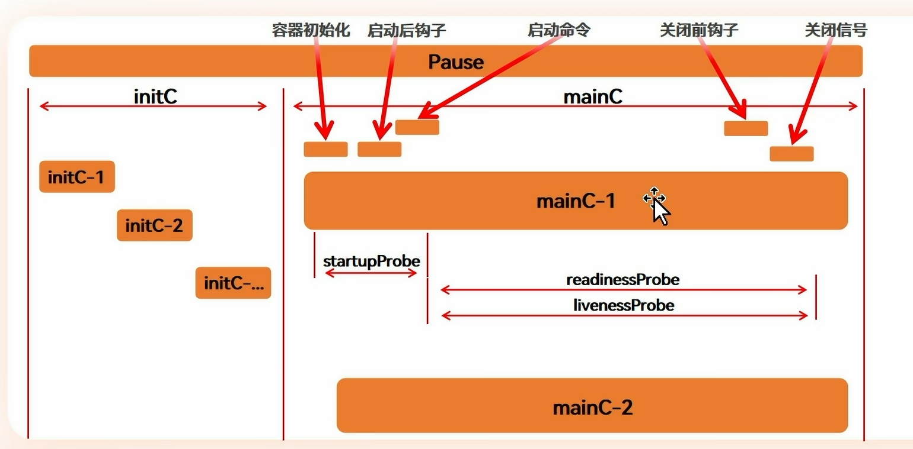

一切皆资源，资源实例化为对象
清单为yaml格式
# 资源类别
- 名称空间级别
- 集群级资源
- 元数据型资源
```bash
kubectl get node -n xxx
# n->namespace 只对名称空间级别资源有效
# 集群级别显示全部
```

# 结构

```bash
kubectl explain xxx(.xx)
# 查询xxx资源的api字段和说明文档，包括它的group/version,kind等
```

# 生命周期

- pause
全程存在
- initC
有多个，不会同时存在，任一失败全部重新
- mainC