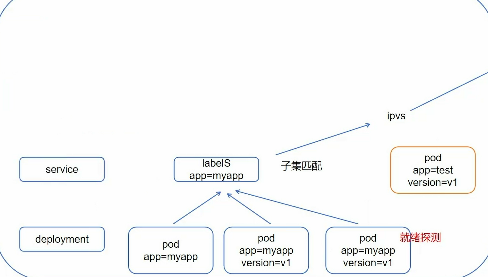

一切皆资源，资源实例化为对象，不仅node，svc是资源，node（master）也是

# 资源类别
- 名称空间级别
- 集群级资源
- 元数据型资源
```bash
kubectl get node -n xxx
# n->namespace 只对名称空间级别资源有效
# 集群级别显示全部
```

# 结构
清单为yaml格式

```bash
kubectl explain xxx(.xx)
# 查询xxx资源的api字段和说明文档，包括它的group/version,kind等
```

# 生命周期

```bash
kubectl create -f pod.yaml
# -f为通过本地文件创建

kubectl get xxx -w
# 观察资源情况（是否ready）
# -w为动态观察
```
## initC
有多个，不会同时存在，任一失败全部重新
利用这个==阻塞特性==可以设置死循环来判断某个必须先启动的容器是否启动
```bash
kubectl describe pod podName
# 查看资源对象更详细的信息，包括event
```

## 探针
定期对当前pod的kubelet对容器诊断，诊断需要调用有容器实现的handler

- 就绪探针readlinessProde
可通过httpGet，exec脚本，tcp端口检测（不常用）三种方式

svc资源创建时就要想到
	标签==子集匹配==：方便后续形成负载均衡
	pod必须就绪状态：用到了==就绪探针==

- 存活探针livenessProde
依旧三种方式

- 启动探针startupProde
解决就绪探针，存活探针不知道何时开始检测的问题
```yaml
apiVersion: v1
kind: Pod
metadata:
  name: startupprobe-1
  namespace: default
spec:
  containers:
    - name: myapp-container
      image: wangyanglinux/myapp:v1.0
      imagePullPolicy: IfNotPresent
      ports:
        - name: http
          containerPort: 80
		  # 该端口是容器内部端口
      readinessProbe:
        httpGet:
          port: 80
          path: /index2.html
          # 该路径存在于容器内部，由镜像中的应用myappv1.0(真实存在）提供
		  # 检测方式就是通过httpGet方式去到容器内部查看该端口下的这个路径有无此文件
		  # 并非去检测镜像的，探针指在pod内部执行，不经过外部网络
        initialDelaySeconds: 1
        periodSeconds: 3
      startupProbe:
        httpGet:
          path: /index1.html
          port: 80
        failureThreshold: 30
        periodSeconds: 10
        
```


## mainC


