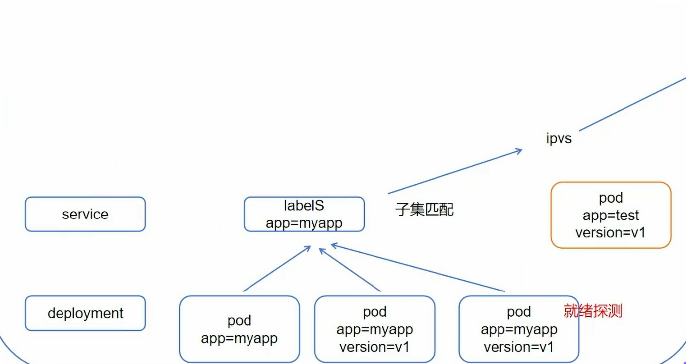

一切皆资源，资源实例化为对象，不仅node，svc是资源，node（master）也是

# 资源类别
- 名称空间级别
- 集群级资源
- 元数据型资源
```bash
kubectl get node -n xxx
# n->namespace 只对名称空间级别资源有效
# 集群级别显示全部
```

# 结构
清单为yaml格式

```bash
kubectl explain xxx(.xx)
# 查询xxx资源的api字段和说明文档，包括它的group/version,kind等
```
==快速创建模板==
```bash
kubectl create 资源 资源名 --image=thxlinux/myapp:v1.0 --dry-run=client -o yaml
> xxx.yaml.tmp
# --image 指定容器镜像，仅适用于pod,deployment
# --dry-run=client/server 干跑，并不创建
# -o yaml 输出为yaml格式
# > 重定向xx文件
```
# 生命周期

```bash
kubectl create -f pod.yaml
# -f为通过文件创建

kubectl get xxx -w
# 观察资源情况（是否ready）
# -w为动态观察
```
## 初始化容器initC
有多个，不会同时存在，任一失败全部重新
利用这个==阻塞特性==可以设置死循环来判断某个必须先启动的容器是否启动
```bash
kubectl describe pod podName
# 查看资源对象更详细的信息，包括event
```

## 探针Prode
定期对当前pod的kubelet对容器诊断，诊断需要调用有容器实现的handler

- 就绪探针readlinessProde
可通过httpGet，exec脚本，tcp端口检测（不常用）三种方式


svc资源创建时就要想到
	标签==子集匹配==：方便后续形成负载均衡
	pod必须就绪状态：用到了==就绪探针==

- 存活探针livenessProde
依旧三种方式

- 启动探针startupProde
解决就绪探针，存活探针不知道何时开始检测的问题
```yaml
apiVersion: v1
kind: Pod
metadata:
  name: startupprobe-1
  namespace: default
spec:
  containers:
    - name: myapp-container
      image: wangyanglinux/myapp:v1.0
      imagePullPolicy: IfNotPresent
      ports:
        - name: http
          containerPort: 80
		  # 该端口是容器内部端口
      readinessProbe:
        httpGet:
          port: 80
          path: /index2.html
          # 该路径存在于容器内部，由镜像中的应用myappv1.0(真实存在）提供
		  # 检测方式就是通过httpGet方式去到容器内部查看该端口下的这个路径有无此文件
		  # 并非去检测镜像的，探针指在pod内部执行，不经过外部网络
        initialDelaySeconds: 1
        periodSeconds: 3
      startupProbe:
        httpGet:
          path: /index1.html
          port: 80
        failureThreshold: 30
        periodSeconds: 10
        
```

### 跳过探针
```bash
kubectl patch service <svc-name> -p '{"spec":{"publicNotReadyAddress":true}}'
# 情况特殊，不管是否就绪
# 打补丁即可
```
## 钩子Hook
由kubulet发起，可同时为pod中所有容器配置钩子
分为两种
- postStart
- preStop


# 题目
1. k8s 部署一个 pod 的流程
~~根据deployment的资源清单，调度器判断将pod部署在哪个节点~~

通过kubectl命令将deployment.yaml文件转化为json格式提交到apiserver，deployment controller监听apiserver创建rs，rs controller创建pod（此时为pending状态），scheduler监听到未绑定节点的pod，为其选择节点，节点上的kubectl调用容器运行时启动容器

2. 如何查看 k8s 一个运行的 pod 的 yaml 文件
kubectl get pod <pod-name/> -o yaml

3. k8s 有哪些组件？每个组件的作用？
~~pod,rs,deployment,job,cronjob,schdule,svc~~

上面是api资源，并不是组件
apiserver,etcd,scheduler,各种控制器
kubelet,kubeproxy,容器运行时

4. k8s 如何用命令行部署一个 pod？
kubectl create pod -f pod-demo.yaml

5. 如何查看 pod 资源支持的属性信息？
~~kubectl explain pod <pod-name/>~~

explain是查看该api资源的结构，不能查看个例
kubectl explain pod(.spec(.containers))

6. k8s 最小的调度单元是？
pod

7. pod 中的容器之间的关系是？
共享网络地址，端口，存储卷，IPC

8. 如何查看容器被部署到哪个节点中了
kubectl describe pod <pod-name/>

9. 如何在 k8s 中查看容器的日志？如何查看此容器之前的日志？
kubectl logs <pod-name/> -c <container-name/>
kubectl logs <pod-name/> -p

10. 容器中的日志和传统的日志的区别？
容器日志随容器销毁而丢失

11. namespace 的作用
逻辑隔离单位--->资源隔离避免命名冲突，权限控制等

12. 通过什么可以对 namespace 中的资源做限制？
ResourceQuota限制资源总量
LimitRange设置默认值

13. 当我们运行容器的时候，发现容器能启动，但是很快状态变成了 completed，或者 crashbackoff 了，请问可能的原因是什么，如何排查
先kubectl describe pod <pod-name/>查看events
再kubectl logs pod-demo -c <container-name/>
再看上次崩溃日志kubectl logs <pod-name/> -p

14. 如何进入具有两个容器的 pod 呢？给出具体的命令
kubectl exec -it <pod-name/> -c <container-name/> -- /bin/sh
